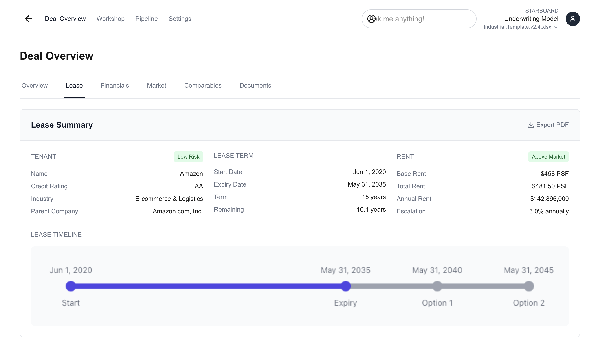

# 📄 Lease Abstract – Real Estate Investment UI

A modular, responsive Lease Abstract tab built with **Next.js**, **Tailwind CSS**, and **React**, designed for real estate investors to quickly understand lease terms, tenant info, and financial recovery structure.

---

## 🚀 Live Demo

👉 [View Demo](https://lease-abstract.vercel.app/)
🔗 [GitHub Repo](https://github.com/divyabaid16/lease-abstract)

---

## 🧩 Features

- ✅ **Tenant & Lease Summary** – LCD/LXD timeline, renewal options, tenant info
- 💸 **Rent Breakdown** – PSF by component + escalation view
- 📦 **Recovery Terms** – CAM, insurance, taxes, and renewals
- ⚠️ **Risk Analysis** – Lease expiry warnings, market risk indicators
- 📤 **PDF Export** – Clean, exportable lease snapshot (html2canvas + jsPDF)
- 📱 **Responsive Design** – Optimized for mobile & desktop
- 📊 **Chart-Ready Layout** – Easily integrates with Chart.js or Recharts

---

## **Main Components**:

-`LeaseAbstract`: The main container component that manages state and orchestrates the other components

-`LeaseSummary`: Displays the key lease information and timeline

-`RentComponents`: Shows rent components and escalations

-`RecoveryTerms`: Displays recovery terms and renewal options

-`RiskAnalysis`: Shows risk factors and market analysis

2.**UI Components**:

-`SectionCard`: Reusable collapsible card component

-`InfoCard`: Displays a group of related information

-`Badge`: Shows status indicators

-`DataTable`: Reusable table component

---

## Technical Decisions

1.**Canvas vs. HTML for Timeline**:

- Used canvas for the interactive timeline for flexibility in drawing complex visualizations
- Created a static HTML fallback for PDFexport to ensure visibility
- This dual approach ensures both interactivity and reliable PDFexport

2.**PDF Export**:

- Used html2canvas and jsPDF for PDF generation
- Implemented special handling for canvas elements
- Added CSS classes for PDF-specific styling
- Created a clone of the DOM to avoid modifying the original UI

3.**State Management**:

- Used React's useState for managing the open/closed state of sections
- Implemented a toggle mechanism for expandable sections

4.**Data Formatting**:

- Created utility functions for consistent formatting of dates and currency values
- Used data transformation functions to prepare data for charts and tables

5.**Responsive Design**:

- Implemented responsive grid layouts usingTailwind CSS
- Used appropriate spacing and sizing for different screen sizes

---

### Code Quality Improvements

1.**Reduced Repetition**:

- Used mapping functions to generate UI elements from data arrays
- Created reusable components for common patterns
- Extracted repeated styling into component props

2.**Improved Readability**:

- Split large components into smaller, focused ones
- Used descriptive variable and functionnames

  - Addedcommentsforcomplexlogic

3.**Enhanced Maintainability**:

- Organized related functionality into separate files
- Used consistent patterns across components
- Separated UI components from data handling logic

---

## Future Improvements

1.**Performance Optimization**:

- Implement virtualization for large data sets
- Add memoization for expensive calculations
- Optimize PDF generation for larger documents

2.**Enhanced Features**:

- Add interactive tooltips to the timeline
- Implement comparison views for multiple leases
- Add data export in multiple formats (Excel, CSV)

3.**Accessibility**:

- Improve keyboard navigation
- Add ARIA attributes for screen readers
- Enhance focus management

4.**Testing**:

- Add unit tests for components
- Implement integration tests for PDF generation
- Add visual regression testing

---

## 🏗 Tech Stack

- **Framework**: [Next.js](https://nextjs.org/)
- **Styling**: [Tailwind CSS](https://tailwindcss.com/)
- **PDF Export**: [html2canvas](https://www.npmjs.com/package/html2canvas), [jsPDF](https://www.npmjs.com/package/jspdf)
- **Data**: Mocked JSON (can be replaced with API)
